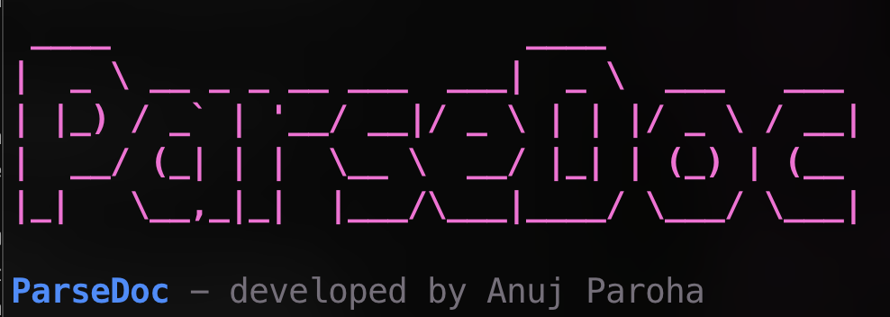
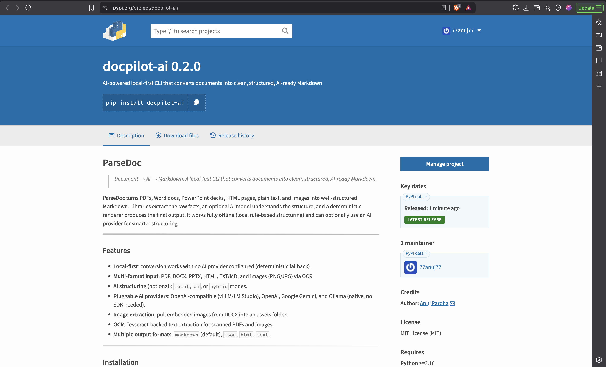
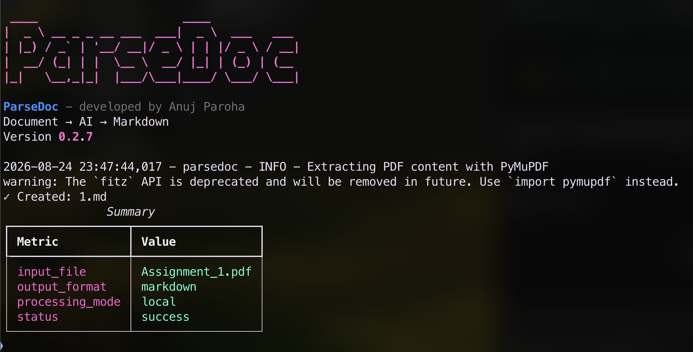

# ParseDoc



[](https://pypi.org/project/docpilot-ai/)
[](https://pypi.org/project/docpilot-ai/)
[](LICENSE)
[](https://github.com/psf/black)

> Document → AI → Markdown. A local-first CLI that converts documents into clean, structured, AI-ready Markdown.

ParseDoc turns PDFs, Word docs, PowerPoint decks, HTML pages, plain text, and images into well-structured Markdown. Libraries extract the raw facts, an optional AI model understands the structure, and a deterministic renderer produces the final output. It works **fully offline** (local rule-based structuring) and can optionally use an AI provider for smarter structuring.

---

## Demo

[](https://youtu.be/Cz8ORg6Fs1Y)

Watch the demo on YouTube: https://youtu.be/Cz8ORg6Fs1Y

---

## Screenshots






---

## Features

- **Local-first**: conversion works with no AI provider configured (deterministic fallback).
- **Multi-format input**: PDF, DOCX, PPTX, HTML, TXT/MD, and images (PNG/JPG) via OCR.
- **AI structuring** (optional): `local`, `ai`, or `hybrid` modes.
- **Pluggable AI providers**: OpenAI-compatible (vLLM/LM Studio/OpenRouter), OpenAI, Google Gemini, Ollama (native), and LM Studio.
- **Document fidelity**: preserves headings, bold/italic/underline, hyperlinks, nested lists, and keeps tables in their original position.
 - **Image extraction**: `parsedoc image` pulls embedded images from a DOCX or PDF into a folder in your working directory (or a path you choose).
- **OCR**: Tesseract-backed text extraction for scanned PDFs and images.
- **Multiple output formats**: `markdown` (default), `json`, `html`, `text`.

---

## Installation

```bash
pip install docpilot-ai
```

> The PyPI package is named **`docpilot-ai`**; the import name and CLI command are both `parsedoc`.

Full setup, configuration, and provider instructions are in **[setup.md](setup.md)**.

---

## Quick start

```bash
# Convert a single document
parsedoc convert input.docx -o output.md --mode hybrid

# Convert a whole folder (creates ./batch_out in the current directory)
parsedoc batch . -p "*.docx"

# Inspect a document's structure
parsedoc inspect input.pdf --format summary

# Extract all images embedded in a DOCX or PDF into <filename>_assets/ (in the cwd)
parsedoc image input.docx
parsedoc image input.pdf

# Extract images into a specific folder
parsedoc image input.docx -o ./my_images

# Show configuration
parsedoc config list

# Banner + version
parsedoc version
```

### Modes

| Mode | Behavior |
|------|----------|
| `local` | Pure rule-based structuring. No network calls. Fast and private. |
| `ai` | Structures content using the configured AI provider. |
| `hybrid` | Uses AI when available, falls back to local structuring on failure. |

---

## Supported input formats

| Format | Extensions |
|--------|-----------|
| PDF | `.pdf` |
| Word | `.docx` |
| PowerPoint | `.pptx` |
| HTML | `.html`, `.htm` |
| Text / Markdown | `.txt`, `.md`, `.markdown` |
| Images | `.png`, `.jpg`, `.jpeg` (OCR) |

---

## Configuring your API

ParseDoc supports several AI providers. Configure via `parsedoc config`, environment variables, or the TOML file. Examples:

```bash
# OpenAI-compatible (e.g. xkiro)
parsedoc config set --key ai_provider --value openai-compatible
parsedoc config set --key base_url --value "https://api.xkiro.com/v1"
parsedoc config set --key model --value "stealth/ox-alpha-free"
parsedoc config set --key api_key --value "sk-xt-..."

# LM Studio (local, defaults to http://localhost:1234/v1)
parsedoc config set --key ai_provider --value lm-studio
parsedoc config set --key model --value local-model

# Ollama (local)
parsedoc config set --key ai_provider --value ollama
parsedoc config set --key model --value qwen3
```

See **[setup.md](setup.md)** for the complete list of providers (`openai-compatible`, `openai`, `gemini`, `ollama`, `lm-studio`), all config keys, environment-variable overrides, and troubleshooting.

---

## Using ParseDoc as a library

```python
from parsedoc.core.config import Config
from parsedoc.core.pipeline import Pipeline

config = Config().load_from_file()
pipeline = Pipeline(config)

markdown = pipeline.process(
    "report.docx",
    output_format="markdown",
    mode="hybrid",
    extract_images=True,
    output_path="report.md",
)
```

---

## Contributing

Contributions are welcome! See **[CONTRIBUTING.md](CONTRIBUTING.md)** for the
development setup, how to add new parsers/AI providers, and the roadmap for
future integrations such as the **MCP SDK** (exposing ParseDoc as a tool for
LLM agents).

## License

MIT — see [LICENSE](LICENSE).
